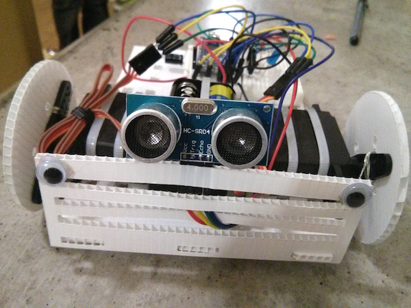
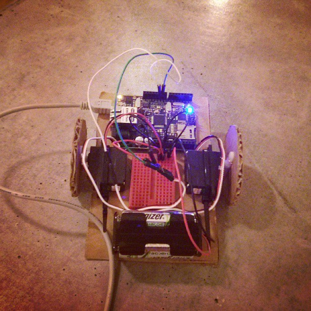
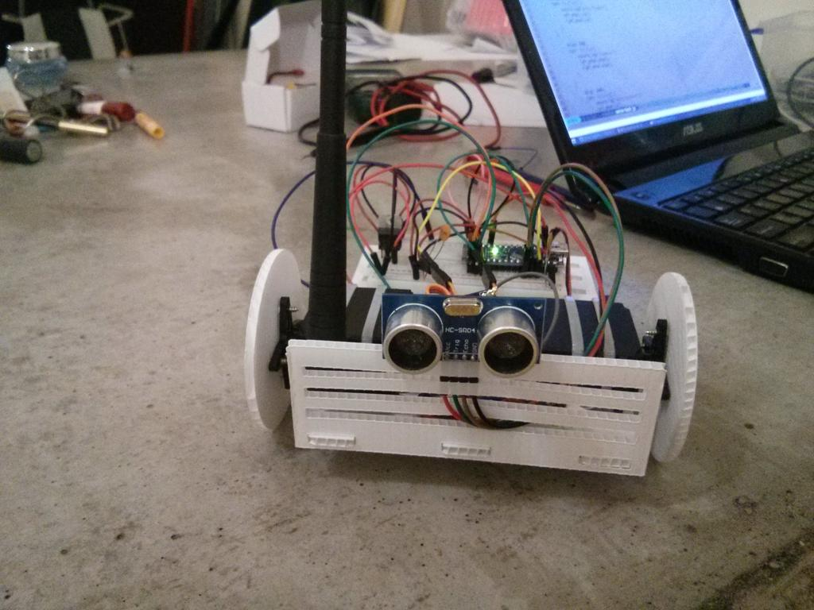
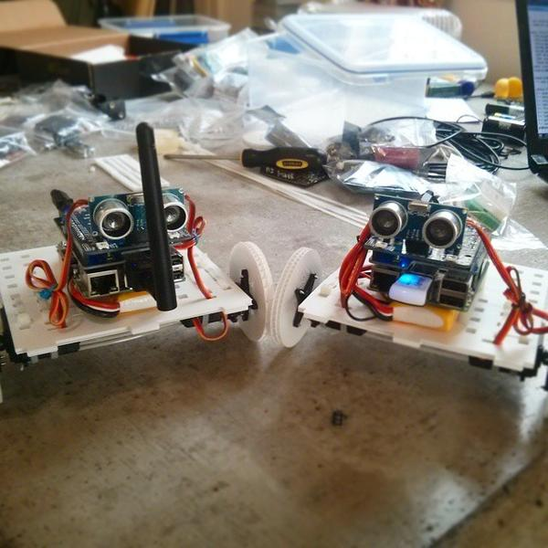
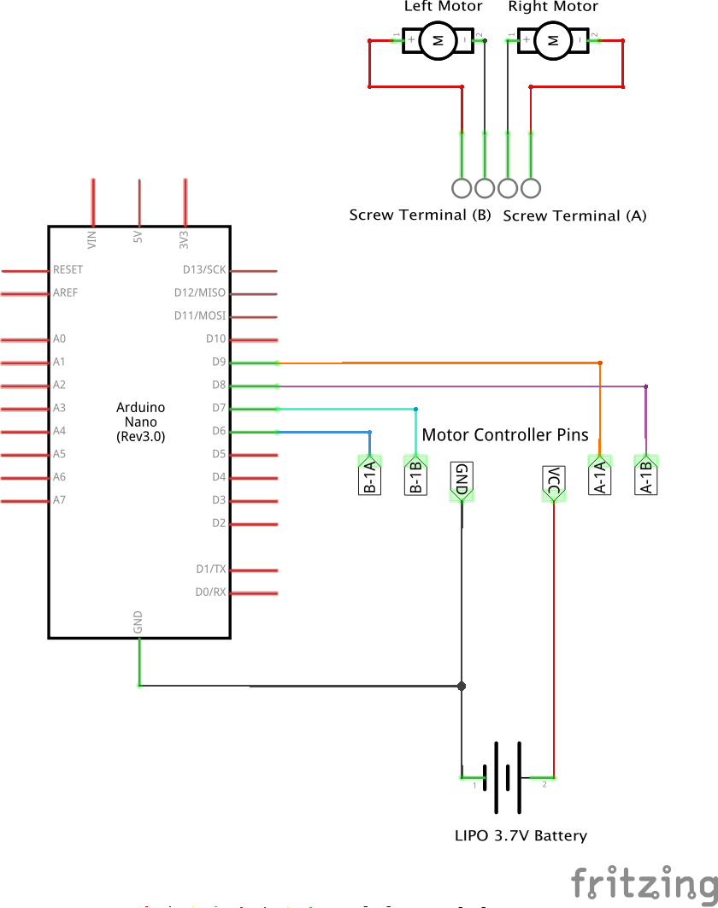
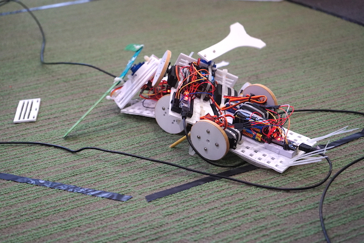

# SimpleBot



## Overview

This is one of the most simple robots you can make. Features are:

* quick to put together (about an hour)
* very hackable (it can be built with cardboard, corflute or laser cut acrylic
or wood so very easily modifiable)
* can move pretty fast (at full tilt it will go about half a metre a second -
faster if you have more juice for the motors!)
* very extendable (much of the magic happens in code and sensors can be easily added)
* Cheap (costs less than AUD$100 which is very cheap for your first robot)

This bot is an adaptation of the excellent [SumoBot Jr](https://github.com/makenai/sumobot-jr/)
made by [Paweł Szymczykowski](http://twitter.com/makenai) but doesn't require
laser cutting wood or plastic to make. However you can laser cut it if you want
something a bit more long lasting.

## Capabilities

The SimpleBot can be tethered over USB or controlled via Bluetooth Serial or
over the network using WiFi. Your computer will do all the hard work of
control processing and interface control etc and just send messages to the
board to steer it.

If you get really sophisticated you can make it have some AI.

This is the very first prototype, put together in about 30 minutes one evening.



As this is such a simple robot, once you've got it working you can then extend
it to make it much more capable including becoming wireless. This one has been
extended with a wifi module to untether it from your computer..



Once you understand how things work you can reuse all of the components to
make a bigger, badder, faster robot and switch the cardboard for more durable
elements such as laser cut wood or plastic if you desire.
We've even [supplied the SVG and DXF files to do exactly that](/physical).

Add a raspberry pi and you get a SimplePiBot which can be made fully autonomous.



## Materials needed

The following are the various components you need to get hold of to make a basic
SimpleBot. If you're making this at a NodeBots event you'll have a set of
components in your kits.

|  # | Component        | Notes                                                                                   |
|:--:|------------------|-----------------------------------------------------------------------------------------|
|  1 | Arduino          | We use Nanos because they are small and inexpensive (and light) but any arduino will do |
| 10 | M-M Jumper wires | The more the better but 10 will be enough to build with                                 |
|  2 | DC Motors        | These are common - get ones with wheels & gears                                         |
|  1 | Battery pack     | LiPo or 4xAA - about 5V is what you're afer                                             |
|  1 | Mini breadboard  | Smaller is better                                                                       |
| 10 | Cable ties       | 3-4mm wide and about 100-200mm long is a good size to work with. The more the better    |

Other things you might want to add to your bot:

* Laser pointer to make an annoying cat toy.
* Stickers to bling out your bot.
* Spikes to take out others; Ben Hur or Mad Max style.
* USB WebCam if you want to give your bot some vision.
* USB cable extender if you want some range.
* Bluetooth or wireless modules to remove the USB cable.
* An Ultrasonic sensor to do obstacle detection
* Reflectance sensors to do line following

# SETUP

To setup your SimpleBot we're assuming you have [Arduino](http://arduino.cc) and
[NodeJS](http://nodejs.org) installed already. Go check out the [johnny five
intro](http://johnny-five.io/platform-support/) for a good getting started guide.

## Install drivers

If you're using an arduino provided to you at a NodeBots event, you will probably
need to install a driver to make it work. They are in the [drivers folder](/drivers)
in the repo and there's a [windows version](/drivers/CH341SER.EXE) and a
[mac version](/drivers/ch340-mac-driver.zip). Just download and follow the installation
prompts. (If you get prompted to open the codebender site, just skip past. As
an aside - codebender is a cool project allowing you to program and manage
embedded devices right from your browser. [Codebender.cc](http://codebender.cc)

## Install the code dependencies

Clone the repo and install everything from here:

```
git clone https://github.com/nodebotsau/simplebot
cd simplebot
npm install
```

## Flashing the arduino

Use `interchange` to install the firmware to the arduino. Plug the arduino in
and then call the following instruction (this assumes you have `./node_modules/.bin/`
on your `$PATH`.

```
interchange install hc-sr04 -a nano --firmata
```

Assuming you get no errors, you're good to go on that front.

## Build a SimpleBot

You can go in a few different directions with the SimpleBot. Details for the
different styles can be found below however the common principles are
discussed in the next section.

* [SumoBot](docs/sumobot.md)
* [Line Follower](docs/linefollower.md)
* [Obstacle avoider](docs/obstacleavoider.md)

### Differential drive

Each SimpleBot is a little different because it's yours but the general principles
are the same. You have two motors, each of which drive a wheel - this is called
[differential drive](https://en.wikipedia.org/wiki/Differential_wheeled_robot) -
and the combination of these working together will drive the robot forward, backwards
and turn on the spot each way.

Use cable-ties (zip ties) to join everything to the chassis.

If you want to see a video explaining this in more detail there's a version
on [you tube](https://www.youtube.com/watch?v=KoACCjtkHIg) (this uses servos on
an older Mark III SimpleBot but the principle holds).

### Basic wiring

The wiring diagrams are provided here:

Schematic:




# Examples

## A simple drive example

In the `examples` folder you can see an example called `motors.js` or
`servos.js` - choose the version depending on your motor types. This is
a very simple control example which uses the arrow and space keys on the keyboard
to drive the SimpleBot around.

Simply run:

```shell
node examples/motors.js SERIAL_DEVICE
```

```shell
node examples/servos.js SERIAL_DEVICE
```

Where `SERIAL_DEVICE` is the path to the serial port (eg `/dev/tty/USB0`).

You should now be able to drive your robot around happily. Go get a few friends
to build one too and you can have SumoBot Battles.




### Tuning servos

If you are using servos and they don't entirely stop then tune the stop value in the code by
setting a LSTOP and RSTOP value that is a little either side of 90 (this is
because CR servos are a hack and may need some tuning).

## Driving over Bluetooth

You can use bluetooth to drive the simplebot.

Get a bluetooth module and configure it. This is a mandatory step before you can
do it properly..

Per [this wiki entry in J5](https://github.com/rwaldron/johnny-five/wiki/JY-MCU-Bluetooth-Serial-Port-Module-Notes)

### Wiring for BT.

Connect the BT Module TX pin to the Arduino RX pin and the BT Module RX pin to
the Arduino TX pin and you should be ready to go. Note that if you need to
flash the arduino or anything you need to unplug the BT module.

### Connecting

Once you've got your bluetooth set up, pair it with your computer so it appears
as a serial device.

Simply go:

```
node examples/motors.js /dev/tty.SERIALPORT
```

Changing the device path to whatever yours is to the Bluetooth Module. You
should now be able to drive using wireless over bluetooth just the same as
using a USB cable.

## Driving using wifi

You can use a simple serial wifi module to make your SimpleBot work over
wireless (increased range, but you need more power). Check
out [this gist for more details](https://gist.github.com/ajfisher/5fe60fe7d8c49b3223f0).

## Game controller

If you happen to have a playstation controller then you can use the
sb-controller.js example to drive your simplebot using a console controller
which is pretty cool.

# LICENSE NOTES

This SimpleBot repo is licensed using the MIT license for all components.

Firmata implementations are modifications of
[https://github.com/firmata/arduino/](Firmata for Arduino) by
[https://github.com/soundanalogous](Jeff Hoefs @soundanalagous) and others and
is used according to the GPL.

Firmata modifications include merged components of
the [https://github.com/jgautier/arduino-1/tree/pulseIn](pulseIn code) as
created by [https://github.com/jgautier](Julian Gautier @jgautier).

