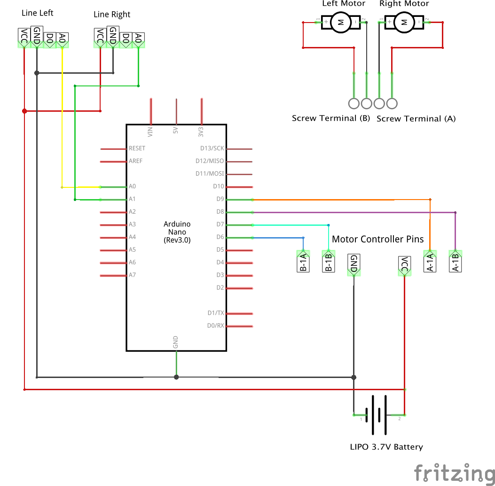

# Physical layout and design considerations for a Line Following robot

This document explains some of the design considerations you might want to
think about when building your robot.

## Electronics

The core electronics are as discussed for the basic SimpleBot build. You should
have a robot you can control with a keyboard to drive around.

### Additional components

* 2x Reflectance sensors

The diagram below shows the electronics schematic for a basic set up.



## Physical modifications

The reflectance sensors need to be pretty close to the ground, less than 1cm
is ideal. Mount them the same distance apart as the tape you'll be detecting.
What you want is for both sensors to be on the tape at the same time and you
can then tell when you are drifting off.

## Calibrating your sensors

Once you have the sensors wired up run `examples/calibrate-line.js` and
then slowly turn your bot back and forth over the line in order to get a sense
of what the minimum and maximum numbers it's seeing.

If you have a really contrasty surface you should get numbers close to 1023 for
full reflection and close to 0 for full absorption. The reality is you'll see
something inside that range.

Note down numbers that give you fairly definitive "on the line" and "off the line"
values.

## How line following works

The most simple line following algorithm is this:

```
// precondition: Both sensors start on the line

loop:
    drive both motors forward
    if (left sensor is off line):
        turn off right motor
    if (right sensor is off line):
        turn off left motor
```

This very simple code will check each of the sensors every time it loops. If
the sensor is on the line then that wheel will stay on as you want it to drive
forwards. If it comes off the line however, you turn the *opposite* wheel off
so that the wheel on the same side of the robot as the sensor is keeps driving.
This will pivot the bot back towards the line and it should move forwards again.

This algorithm is a naive approach and it does work but it is prone to
overshooting and not handling sharp turns. You can make it better with more
line sensors but also by reading the drift to see how much you've drifted or
for how long, this allows you to determine how much to turn back.

## Examples

In the `examples/simplebot-line.js` file you can see a basic example of this
algorithm in practice. If you put your bot on the test track and and run this
code you should see it slowly drive around the track, correcting its position
if it starts to drive off.

