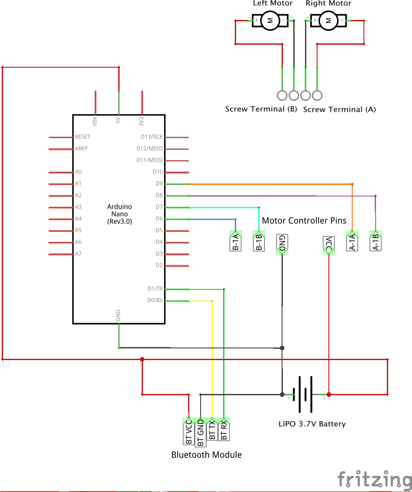
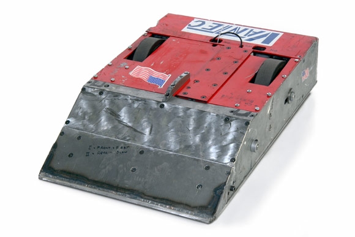
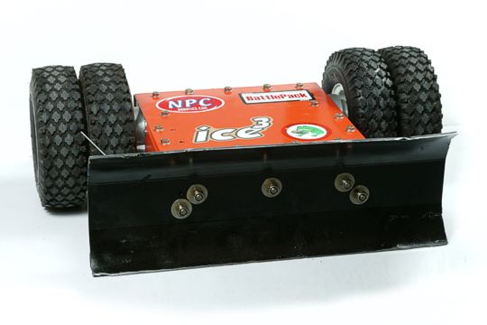
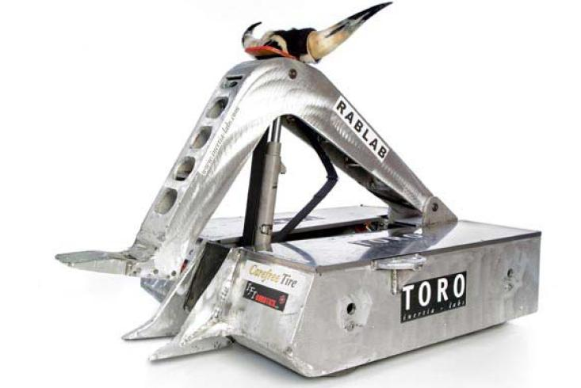
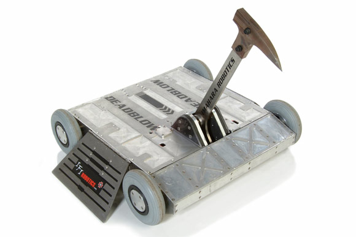

# Physical layout and design considerations for a SumoBot

This document explains some of the design considerations you might want to
think about when building your robot.

## Electronics

The diagram below shows the electronics schematic for a basic set up.

If you do this however, once you move to bluetooth you may run into power
issues where the arduino resets on you. This will be particularly noticeable
when the battery is running flat. So what can you do?

First, keep your battery charged up. You have a charger to do exactly that so
use it. A full LiPo battery gives a nice solid voltage everything can use so
charge between tests and battles.

The second option is to use two batteries. One for your controllers and one for
your motors. The schematic for this is mostly the same except the VCC and GND
lines for your motors and servo connect to the second battery instead.

## Design styles

The maximum size of your bot is 25cm x 25cm x25cm - it has to fit inside that
to go in the ring. Too big and you're disqualified.

There are several design archetypes:

### The Wedge

This is a triangular wedge shape with the main aim being to stay low, move
fast and get under your opponent and run them out of the ring.

To do this effectively:

* Go as light as possible - everything extraneous must be removed
* Attempt to deliver as much speed as possible. This will affect your steering so
drivers need to practice rapid changes of direction and control.
* Traction is critical - when hit an opponent you need traction, make sure
your wheels will grip the floor.
* You need a wedge - it sounds obvious but your whole robot needs to be a wedge
to effectively slide under your opponent. Fabrication of this is critical.

Tactics:

The wedge is all about speed and out manoeuvring your oppenent, especially
those who are slow or have poor turning capability. Look for areas on the
opponent that are raised that will allow you to get underneath. Attack from a
weak side and go fast - don't be afraid to peel off and come back for another run.

### The Sumo

This design calls for weight. You'll move more slowly but with more mass. The
aim is to use your superior weight advantage to push the other opponent out
of the ring.

To do this effectively:

* Look how you can weight your whole robot. Avoid just weighting one part as
this will make you unbalanced.
* You need traction. You're going to go slow, so deliver all the force you can
to your wheels.
* Protect your flanks - your turning speed will be poor so look at ways to
protect your sides (or better yet, make your bot usable in any direction not just
forwards).
* Snarl your opponent - if your opponent can't move then you can just grind them
out of the ring.

Tactics:

Slow and steady wins the bout. Stay to the middle until your opponent is nearby
then wait for them to try and attack you. Make sure you meet them head on and
then use your superior weight to just push them out of the circle. Don't get
caught on the edge.

### The flipper

Hard to pull off effectively, this design is all about winning in style. The aim is to
make a section of your bot that can use servos to flip an opponent. Once they
are incapable of moving, it's a simple task to push them out.

To do this effectively:

* Keep your servo movement small. Servos move at a fixed speed and you want
this to happen fast to catch your opponent off guard. Use mechanical means to
amplify your servo movement into bigger actions.
* Practice your flips against things. It sounds obvious but does your flipper
flip?

Tactics:

Your objective is to close front on and then get your flipper under your
opponent. From there, ACTIVATE and turn that other bot over. Once you've
incapacitated your opponent, just push them out. Your flipper is your key
weapon so make sure you're bringing it to bear on your opponent.

### The whirlygig

This is possibly the craziest design, but pulled off well and it's brutally
effective. You aim is the wholesale destruction of your opponents' electronics
by using a whirling arm mounted on your bot.

To do this effectively:

* Use servos attached to choppers or other mechanical means of wrecking your
opponent's systems.
* It makes you unbalanced but the higher you can come over the top of your
opponent the more chance you have to rip something important out of their
robot.
* Some particularly devastating whirlygigs just spear their opponent then drop
them outside the ring.

Tactics:

You really only have one objective, close with your opponent and unleash your
chopper, smasher, grabber or whirler as fast and as frequently as possible in
an attempt to maximise damage. A few stray wires ripped out and your opponent
will be dead in the ring. Use that opportunity to just ram them out of it.
